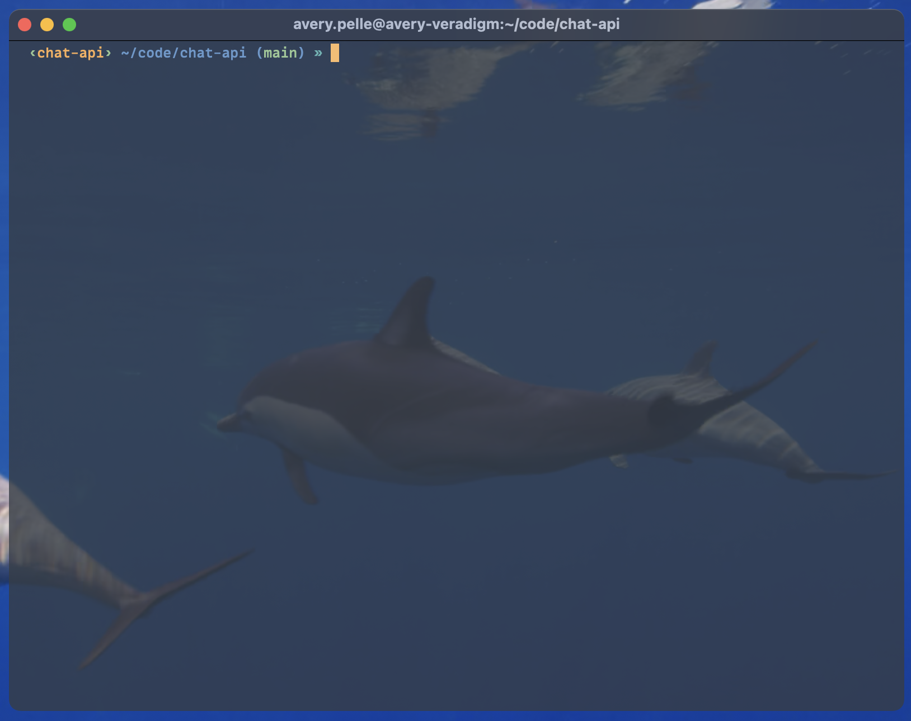

# Avery's Setup

This repo contains my preferred new computer environment setup and shell configuration. It exists so that I can easily replicate my preferences onto a new system in minutes and keep my computers in sync.

## Dependencies

This repo depends on the following tools being installed on your system

- git
- zsh
- oh-my-zsh
- alacritty

## To sync your config with this repo

Run the following commands

```bash
./sync.sh
```

## Worth it

Here is an image of the terminal after the configurations have been applied



# Getting started on a new Mac

## My Apps

1. Download [Spotify](https://www.spotify.com/us/download/mac/) and queue up some tunes. This might take a while.

2. Download [Arc Browser](https://arc.net/).

3. Download and install [VSCode](https://code.visualstudio.com/download). Log In and make sure Settings Sync is on.

4. Get 1Password set up. [Desktop app](https://1password.com/downloads/mac/) and [browser extension](https://1password.com/downloads/browser-extension/).

## Coding Setup

1. Generate a new SSH key for this computer and add it to GitHub. [Follow the guide here](https://docs.github.com/en/authentication/connecting-to-github-with-ssh/adding-a-new-ssh-key-to-your-github-account?tool=webui).

2. Install Xcode Command Line Tools

```bash
xcode-select --install
```

3. Configure git

```bash
# Tell git who you are
git config --global user.email "you@email.com"
git config --global user.name "Your Name"

# other useful git configs
git config --global --add --bool push.autoSetupRemote true
```

4. Clone this repo

```bash
git clone git@github.com:averypelle/config.git
```

5. [Install Homebrew](https://brew.sh/)

```bash
/bin/bash -c "$(curl -fsSL https://raw.githubusercontent.com/Homebrew/install/HEAD/install.sh)"
```

6. Install [Alacritty terminal](https://github.com/alacritty/alacritty).

```bash
brew install alacritty
```

You will have to navigate to Settings > Privacy & Security > Scroll down and allow Alacritty to run.

7. Install the [MonoLisa](https://www.monolisa.dev/) font

8. Sync the configs

```bash
./sync.sh
```

## Python Setup

See [this guide](https://github.com/ScienceIO/onboarding) for setting up Python, NodeJS, AWS, etc.

## Node Setup

1. Install Node Version Manager (NVM) [from here](https://github.com/nvm-sh/nvm?tab=readme-ov-file#installing-and-updating)

2. Install Node. Note that this will install the latest version of Node, which will become the default version for `nvm`.

```bash
nvm install node
```

3. Install Yarn

```bash
npm install -g yarn
```

## Peripherals

- [Logi Options](https://www.logitech.com/en-us/software/logi-options-plus.html) for [my mouse](https://www.logitech.com/en-us/products/mice/mx-master-3s.910-006558.html).

## Work Apps

- Notion, Figma, Zoom, Slack.
